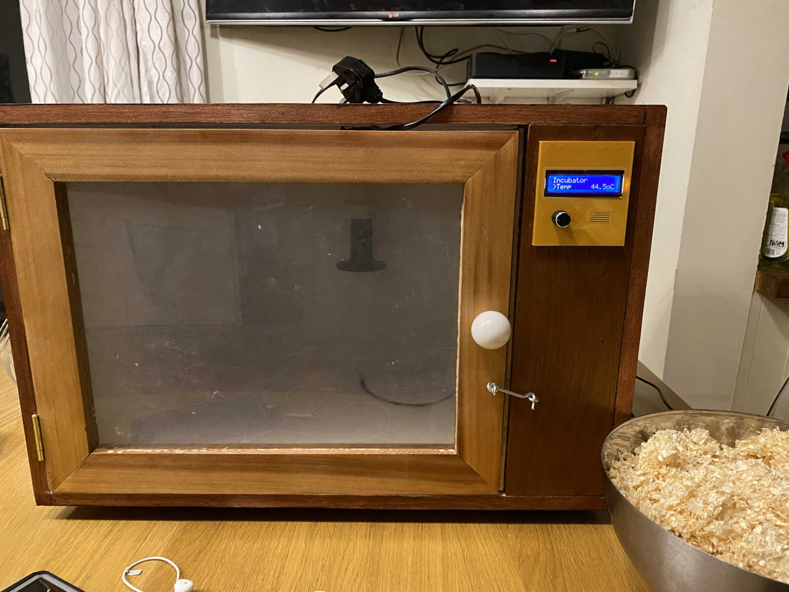
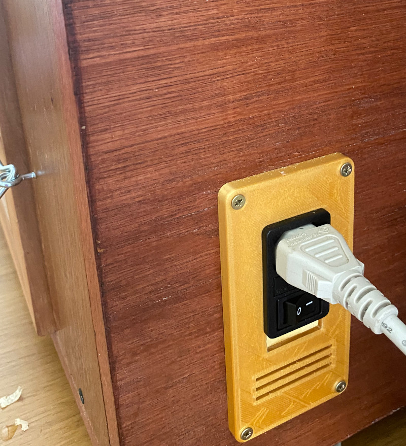

## Open Brooder and Incubator

**BE AWARE THAT THIS PROJECT USES MAINS VOLATAGES, do not proceed unless you are confident to work with such voltages safely.**

This project discusses how to build a simple incubator / brooder for hatching chicks. The project was initially a bit rushed as the chicks outgrew a tiny egg incubator very quickly, so I had to generate this in a few days. Given the situation, it turned out pretty well.

This project uses TcMenu and for me, it runs on a spare Uno I had hanging around. Why Uno, I want to keep Uno around in my libraries for as long as possible and this provides the ultimiate requirement to keep it going. Use a display directly wired to the Uno, the wiring is discussed in the menuProject. But it is essentially an Uno directly connected, a rotary encoder directly connected, and heater, fan, and temperature on Uno pins. There is also a power off sensor attached too that saves the menu structure before power is lost.

The project is split into three sections:

* brooderCircuit - contains the schematics
* designs - contain a few paper based and tinkercad designs for the vero / patch board layout I used
* menuProject - contains a tcMenu based sketch that builds in platformIO.

In terms of wood working, the main cabinet is made out of regular WPB plywood, stained to the outside, painted white to the inside. The door is made from solid cedar wood, and the wooden part of the control panel was made from an offcut of solid 19mm oak. In terms of sizes you can work with whatever suits your situation, I went with approximately 400mm deep, 650mm wide, and approx 430mm high.

## Insulation 

Obviously there's a heater in this design, so it is best to insulate the unit at least to some extent to save energy. I am trying boards I found a craft shop that are foam in the middle with a gloss layer to the outside, these foam boards seem quite good at insulating. Here's a photo:

## Power supply entry

This device runs on 240V mains, it is absolutely essential that the power entry is safely managed, with an appropriate fuse and switch. I used an all in one unit, along with the panel that is in the designs/power directory, it is a free cad design. Again, as I said earlier, this project uses mains voltages, unless you are experienced in electronics, and used to working with live AC voltages, it is better not to attempt this project.

There's a few more images and design documents in the designs folder.
